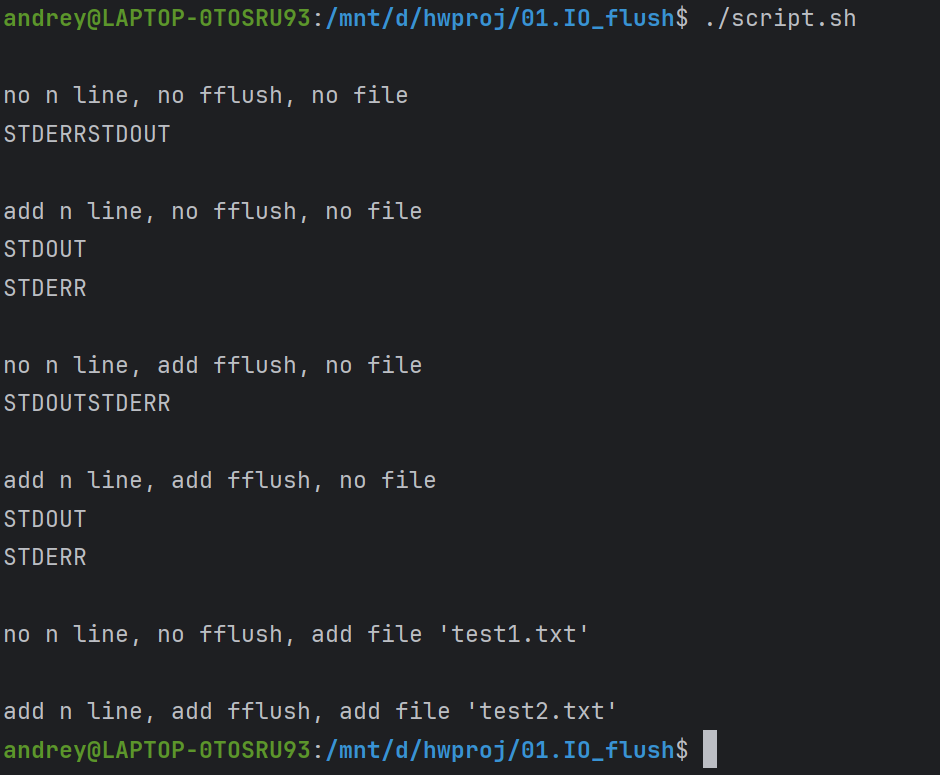
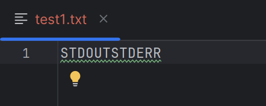
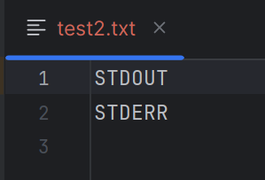

# Task: 01.IO_flush
**OS: Ubuntu 22.04** (запущенная из Win11)

## Run
```
./script.sh
```

## Result Examples

### Result of running script:

### in cli:



### in test1.txt:



### int test2.txt



